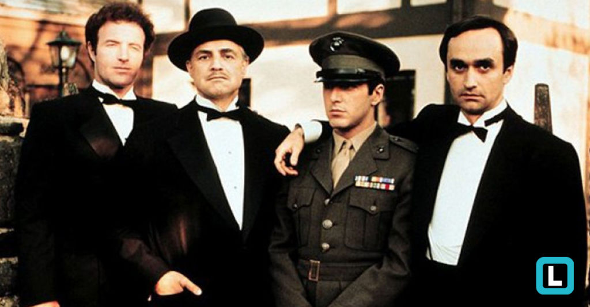

# exemplo_aula
<h1>O Poderoso Chefão</h1>
<h3>Escrito por Mário Puzo</h3>
<h4>Dirigido por Francis Ford Coppola</h4>

&nbsp;&nbsp;<a href="https://www.adorocinema.com/filmes/filme-1628/"> O Poderoso Chefão</a> é tido pelos críticos como o melhor filme de todos os tempos!!! 
&nbsp;&nbsp;Don Vito Corleone <b>(Marlon Brando)</b> é o chefe de uma "família" de Nova York que está feliz, pois Connie <b>(Talia Shire)</b>, sua filha, se casou com Carlo <b>(Gianni Russo)</b>. Porém, durante a festa, Bonasera <b>(Salvatore Corsitto)</b> é visto no escritório de Don Corleone pedindo "justiça", vingança na verdade contra membros de uma quadrilha, que espancaram barbaramente sua filha por ela ter se recusado a fazer sexo para preservar a honra. Vito discute, mas os argumentos de Bonasera o sensibilizam e ele promete que os homens, que maltrataram a filha de Bonasera não serão mortos, pois ela também não foi, mas serão severamente castigados. Vito porém deixa claro que ele pode chamar Bonasera algum dia para devolver o "favor".
  &nbsp;&nbsp; Do lado de fora, no meio da festa, está o terceiro filho de Vito, Michael <b>(Al Pacino)</b>, um capitão da marinha muito decorado que há pouco voltou da 2ª Guerra Mundial. Universitário educado, sensível e perceptivo, ele quase não é notado pela maioria dos presentes, com exceção de uma namorada da faculdade, Kay Adams<b> (Diane Keaton)</b>, que não tem descendência italiana mas que ele ama. Em contrapartida há alguém que é bem notado, Johnny Fontane <b>(Al Martino)</b>, um cantor de baladas românticas que provoca gritos entre as jovens que beiram a histeria. Don Corleone já o tinha ajudado, quando Johnny ainda estava em começo de carreira e estava preso por um contrato com o líder de uma grande banda, mas a carreira de Johnny deslanchou e ele queria fazer uma carreira solo. Por ser seu padrinho Vito foi procurar o líder da banda e ofereceu 10 mil dólares para deixar Johnny sair, mas teve o pedido recusado. Assim, no dia seguinte Vito voltou acompanhado por Luca Brasi  (Lenny Montana)</b>, um capanga, e após uma hora ele assinou a liberação por apenas mil dólares, mas havia um detalhe: nas "negociações" Luca colocou uma arma na cabeça do líder da banda. Agora, no meio da alegria da festa, Johnny quer falar algo sério com Vito, pois precisa conseguir o principal papel em um filme para levantar sua carreira, mas o chefe do estúdio, Jack Woltz<b> (John Marley)</b>, nem pensa em contratá-lo. Nervoso, Johnny começa a chorar e Vito, irritado, o esbofeteia, mas promete que ele conseguirá o almejado papel. 
 &nbsp;&nbsp;Enquanto a festa continua acontecendo, Don Corleone comunica a Tom Hagen <b>(Robert Duvall)</b>, seu filho adotivo que atua como conselheiro, que Carlo terá um emprego mas nada muito importante, e que os "negócios" não devem ser discutidos na sua frente 
<code>>&nbsp;&nbsp;Francis Ford Coppola transforma "O Poderoso Chefão",em um marco na história do cinema,e principalmente de sua carreira.Consegue montar uma história fenomenal,com personagens marcantes.E não podendo esquecer,da <i>"Família Corleone",que extremamente sangrenta</i>,faz o filme ser tenso e cheio de expectativas nos componentes</code>
